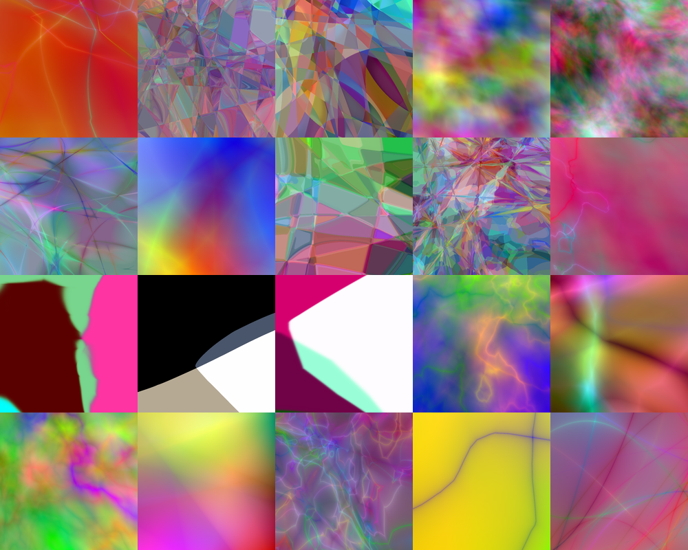
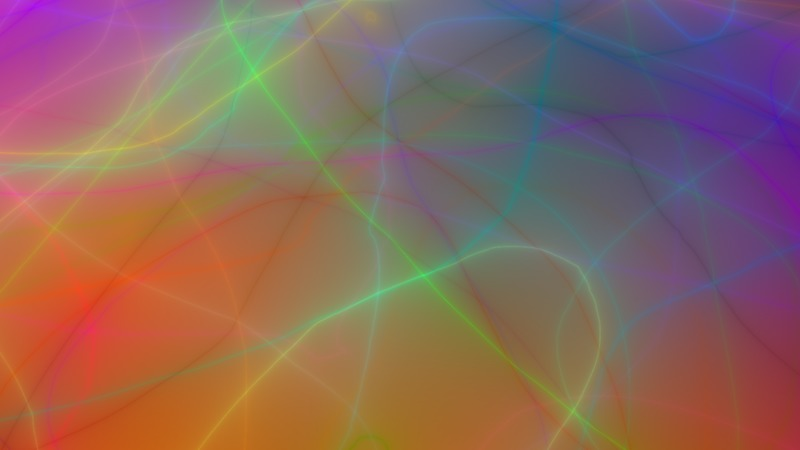

# Neural Painter
We use a neural network that takes a coordinate (x, y) and output the
corresponding RGB value to generate an image.

With different random hyperparameters, the network generates images
of large style variance.

# Gallery





# Details
The image is generated using a single-path feed-forward network with only
fully-connected layers and batch-normalization, flavored with various
nonlinearities and initialized with gaussian random weights.

The key to generate these intriguing images is the use of random nonlinearities
from a large nonlinearity pool at each layer, especially those discontinuous functions (like sign) or functions with large gradient near some point (e.g, log(abs(x) + eps)).

Here are the nonlinearities we've used so far:
```python
NONLIN_TABLE = dict(
    relu=T.nnet.relu,
    tanh=T.tanh,
    abs_tanh=lambda x: abs(T.tanh(x)),
    sigmoid=T.nnet.sigmoid,
    softplus=T.nnet.softplus,
    sin=T.sin,
    cos=T.cos,
    sgn=T.sgn,
    sort=lambda x: T.sort(x, axis=1),
    abs=abs,
    log_abs=lambda x: T.log(abs(x) + eps),  # this is awesome
    log_abs_p1=lambda x: T.log(abs(x) + 1),
    log_relu=lambda x: T.log(T.nnet.relu(x) + eps),
    log_square=lambda x: T.log(x**2 + eps),  # just a scalar

    xlogx_abs=lambda x: T.xlogx.xlogx(abs(x) + eps),
    xlogx_abs_p1=lambda x: T.xlogx.xlogx(abs(x) + 1),
    xlogx_relu=lambda x: T.xlogx.xlogx(T.nnet.relu(x) + eps),
    xlogx_relu_p1=lambda x: T.xlogx.xlogx(T.nnet.relu(x) + 1),
    xlogx_square=lambda x: T.xlogx.xlogx(x**2 + eps),

    softmax=T.nnet.softmax,
    logsoftmax=T.nnet.logsoftmax,
    hard_sigmoid=T.nnet.hard_sigmoid,
    identity=lambda x: x,
    square=lambda x: x**2
)
```

See https://github.com/zxytim/neural-painter/blob/master/neural_painter.py for implementation. The code is based on theano.


# Try it on your own
```bash
./neural_painter.py --image_size 800x800 --hidden_size 100 --nr_hidden 4 --nonlin random_every_time --nr_channel 3 --output_nonlin identity --coord_bias --seed 42 --output 42.png
```

# Related Project
- Npainter (Neural Painter in browser, using RNN, by rupeshs)
	- Demo: https://rupeshs.github.io/npainter/
	- Github: https://github.com/rupeshs/npainter


# Related Links

- Wikipedia page for Compositional pattern-producing network
	- https://en.wikipedia.org/wiki/Compositional_pattern-producing_network
- CPPN in Tensorflow
	- https://github.com/hardmaru/cppn-tensorflow
- Image regression from karpathy:
	- http://cs.stanford.edu/people/karpathy/convnetjs/demo/image_regression.html
- Generating Abstract Patterns with TensorFlow:
	- http://blog.otoro.net/2016/03/25/generating-abstract-patterns-with-tensorflow/
- High resolution MNIST generator (CPPN + GAN/VAE)
	- http://blog.otoro.net/2016/04/01/generating-large-images-from-latent-vectors/

# We are Hiring!
We are researchers from **Megvii** (http://www.megvii.com), a Beijing based computer vision startup.
We are booming and yearning for great talents like you!

If you are interested or want to know more, send us your CV or anything you'd like to know to zxy at megvii dot com.

